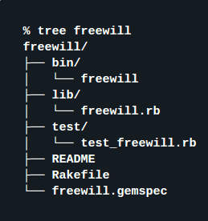

# Gemas

Una gema es una librería <b>Ruby</b>. Se utilizan para compartir código entre desarrolladores. Una gema se compone de un nombre, una versión y una plataforma.

### Estructura
Ejemplo de una gema   

