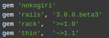

# Gemfile

Archivo sin extensión utilizado por el usuario para especificarle a bundler las dependencias del proyecto.

+ La idea es que haya una por proyecto, si se necesitan distintas gemas dependiendo de la plataforma por ejemplo se puede usar el Symbol *:platform*.

+ Para especificar que no cambie el número **MAJOR** de una librería se debería especificar ~>1.2 (Sería como decir, siempre la versión 1. pero a partir de 1.2 para arriba, encajan 1.3, 1.4.)
  

 

+ Cada vez que se hace un **bundle install** cambia el **Gemfile.lock** aquí se especifican las versiones de las librerías que se descargaron para el proyecto en que fecha fueron descargadas.

+ **bundle install** : Instala las dependencias especificadas en el Gemfile.
+ **bundle update** : Actualiza las librerías que se encuentran intaladas en el proyecto.
